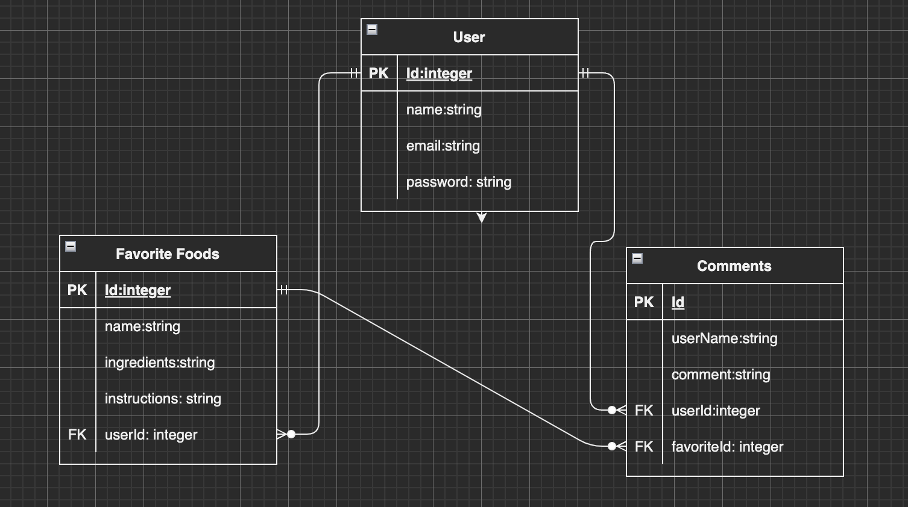
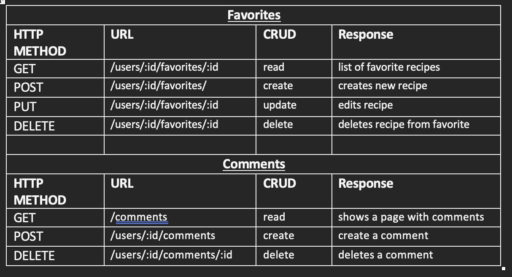
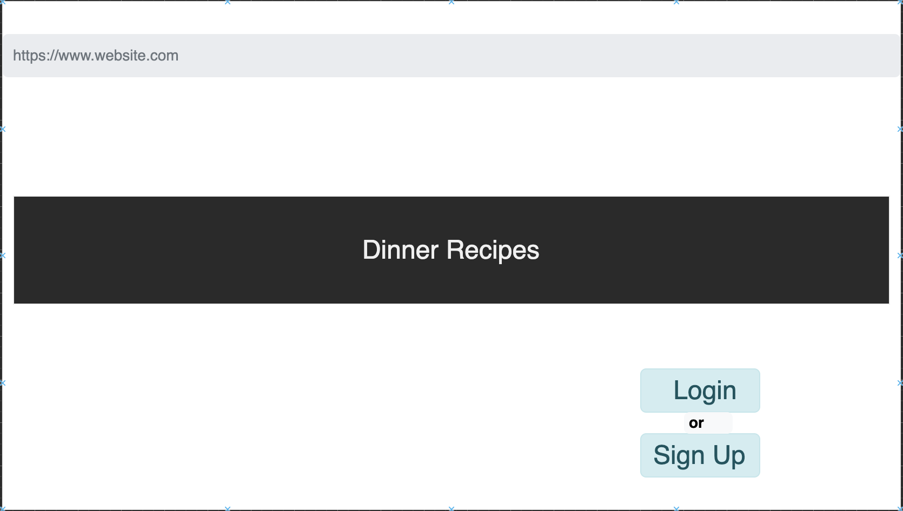
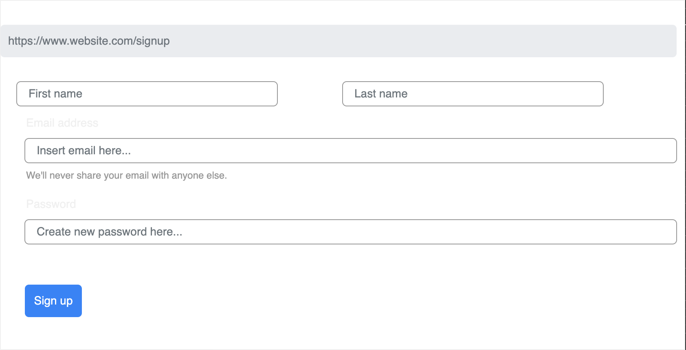
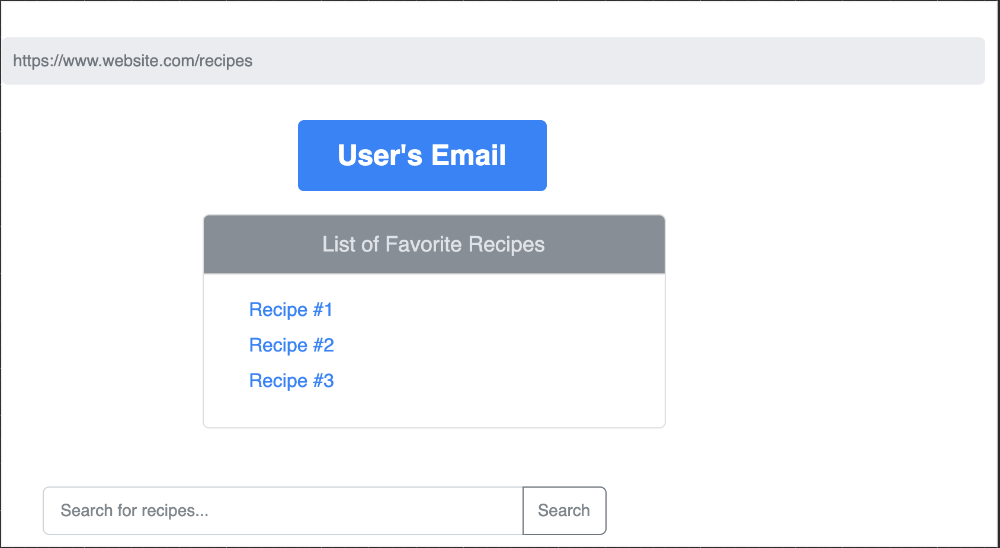

# Project Pitch
#
## Description
#
# API
# https://www.themealdb.com/api.php
#
# MVP
* Homescreen with buttons to login or Sign up
* Sign-up page that gives option to sign up and create account
* User/favorites page that has favorite recipes as well as option to click on Recipe to add a comment 
* Search bar that allows user to search the API by recipe name or ingredient
* update account page that allows user to update their credentials
#
#
# Tech Stack
* html
* Javascript
* css
* Express
* EJS
* Postgres
* Sequelize
* Cookie Parser
* Axios
* Dotenv
#
# ERDs

#
# Restful Routing Chart

 

# Wireframes

# User Stories
* As a user, I want to be able to create a new profile
* As a user, I want to be able to view my profile
* As a user, I want to be able to search for recipes
* As a user, I want to be able to add recipes to my favorites
* As a user, I want to be able to add comments
#
# STRETCH GOALS
* add images
* option to click image that takes you to said recipe related to image

